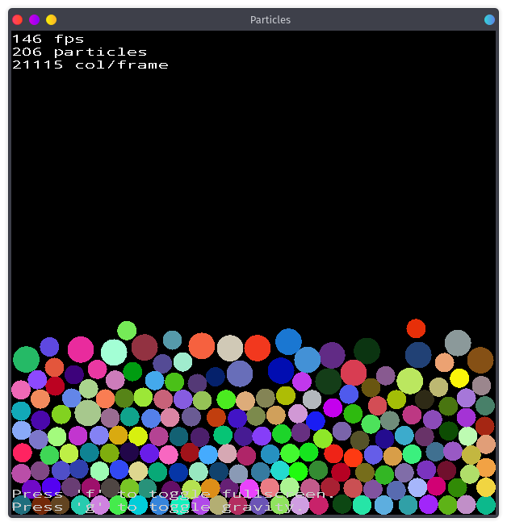
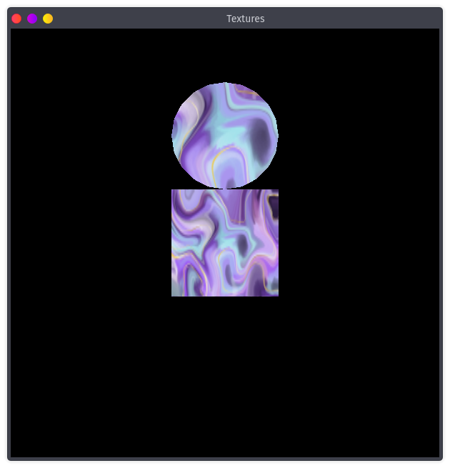
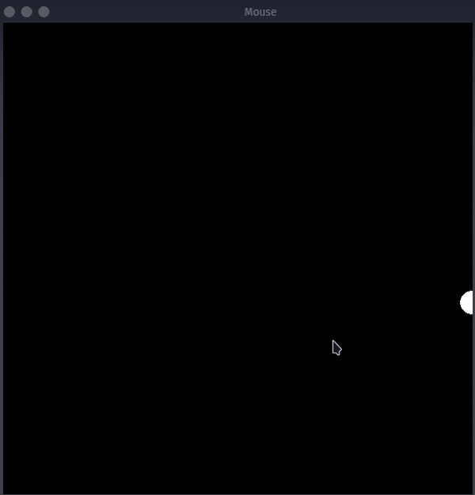

# VBah
A graphic library in Bah, built on [Glut](https://www.opengl.org/resources/libraries/glut/) and [OpenGL](https://www.opengl.org/).

This uses the OpenGL coordinates system. [0.0;0.0] is the center of the window. Edges are at -1.0 and 1.0.
The horizontal axis is x and the vertical axis is y.

## Usage
Note that this includes libraries that are typically shared.
**You will need to add the `-d` option to compile your program.**

### Step 1 - Dependencies
Make sure you have [OpenGL](https://www.opengl.org/) and [Glut](https://www.opengl.org/resources/libraries/glut/) C libraries installed.

### Step 2 - Writting code
Make a new program `main.bah`.
```bah
#include "include.bah"
#include "vbah.bah"

win window*

display() {
    drawCircle(0.0, 0.0, 0.05, rgb(1.0, 1.0, 1.0))
}

main(args []cpstring) int {
    win = window(600, 600, "Mouse")
    win.display = display
    win.launch()
    return 0
}
```

### Step 3 - Compiling
Compile your program, `bah main.bah -d`.

## Useful functions
- **rgb(r float, g float, b float) rgb** makes a rgb struct,
- **rgbTexture(path cpstring, w int, h int) rgb** makes a rgb struct from a BMP image path,
- **setDrawingColor(color rgb) bool** sets the current drawing color/texture from a rgb struct,
- **drawCircle(x float, y float, radius float, color rgb)** draws a circle,
- **drawBox(x float, y float, w float, h float, color rgb)** draws a box (rectangle),
- **drawText(x float, y float, color rgb, font ptr, str cpstring)** draws text,
- **clearFrame()** clears the screen (this is automatically done at each frame if `window.autoClear == true` as it is by default),
- **redrawFrame()** ask the scheduler to redraw a frame (this is automatically done at idle is `window.autoLoop == true` as it is by default),
- **sendFrame()** send the frame (this is automatically done after the `window.display` function is returned),
- **pixelsToCoords(x float&ast;, y float&ast;)** translates pixel coordinates to window coordinates (useful for mouse callbacks),
- **window(w int, h int, t cpstring) window&ast;** used for making a window.

### The window structure
Thw window structures allows you to manipulate the current window, such as launching it, setting its callbacks, getting its delta time (time to render last frame in second as float)...

Its usefull fields are:
- **width: int** the window's width as it is launched,
- **height: int** the window's height as it is launched,
- **x: int** the window's x coordinate as it is launched,
- **y: int** the window's y coordinate as it is launched,
- **title: cpstring** the window's title as it is launched,
- **autoClear: bool** weither the frame should be automatically cleared at each frame,
- **autoLoop: bool** weither a new frame should be scheduled after the last one finished,
- **delta: float** the time in second as float that the last frame took to render.

Its callbacks are:
- **display: function()**  called to draw a new frame,
- **idle: function()** called when the scheduler has nothing to do,
- **init: function()** called after the window is launched,
- **click: function(int, bool, int, int)** called when the mouse is clicked,
- **move: function(int, int)** called when the mouse is passively moved,
- **drag: function(int, int)** called when the mouse is draged (button clicked while moving),
- **keyboard: function(char, int, int)** called when a key is pressed on the keyboard.

Its methods are:
- **launch()** launches the window,
- **fps() int** returns the current number of frames per second,
- **getWidth() int** used for making the window fullscreened,
- **getHeight() int** returns the width of the window in pixels,
- **fullscreen()** returns the height of the window in pixels,

## Examples
- [Particles](./examples/particles.bah), a simple particle system. <br> 
- [Textures](./examples/textures.bah), a demonstration of loading textures. <br> 
- [Mouse](./examples/mouse.bah), a demonstration of mouse callbacks. <br> 