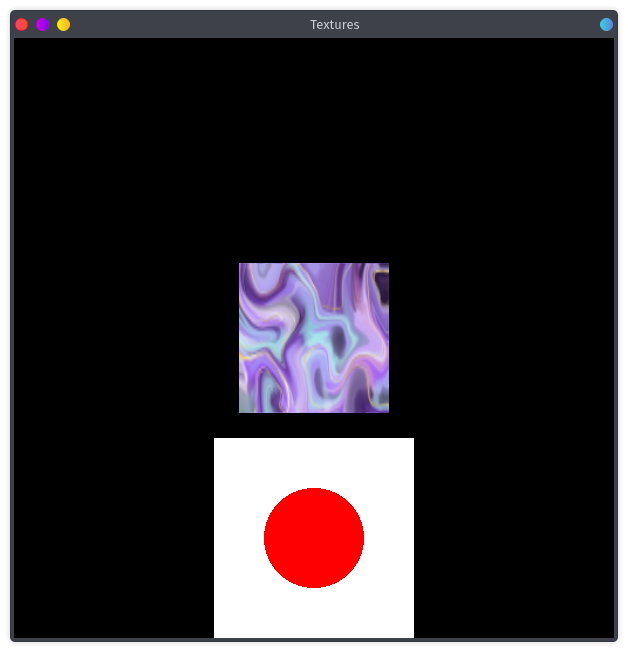

# VBah
A graphic library in Bah, built on [Glut](https://www.opengl.org/resources/libraries/glut/) and [OpenGL](https://www.opengl.org/).

This uses the OpenGL coordinates system. [0.0;0.0] is the center of the window.

**The window borders can change**, if the window is resized or does not have an aspect ratio of 1:1.
To get the current window's borders, use:
- **window.lb** the left border (smallest x coordinate),
- **window.rb** the right border (biggest x coordinate),
- **window.bb** the bottom border (smallest y coordinate),
- **window.tb** the top border (biggest y coordinate).

## Usage
Note that this includes libraries that are typically shared.
**You will need to add the `-d` option to compile your program.**

### Step 1 - Dependencies
Make sure you have [OpenGL](https://www.opengl.org/) and [Glut](https://www.opengl.org/resources/libraries/glut/) C libraries installed.

### Step 2 - Writting code
Make a new program `main.bah`.
```bah
#include "include.bah"
#include "vbah.bah"

win window*

display() {
    drawCircle(0.0, 0.0, 0.05, rgb(1.0, 1.0, 1.0))
}

main(args []cpstring) int {
    win = window(600, 600, "My window")
    win.display = display
    win.launch()
    return 0
}
```

### Step 3 - Compiling
Compile your program, `bah main.bah -d`.

## Useful functions
- **vec(x float, y float) vec** makes a vector (2d point),
- **vec4(x1 float, y1 float, x2 float, y2 float) vec** makes a 4 components vector (can be used as identity matrix for matrix transformations),
- **rgb(r float, g float, b float) rgb** makes a rgb struct,
- **rgbTexture(path cpstring, w int, h int) rgb** makes a rgb struct from a BMP image path,
- **setDrawingColor(color rgb) bool** sets the current drawing color/texture from a rgb struct,
- **drawCircle(v vec, radius float, color rgb)** draws a circle,
- **drawBox(v vec, w float, h float, color rgb)** draws a box (rectangle),
- **drawShape(shape []float, color rgb)** draws a custom shape,
- **drawText(v vec, color rgb, font ptr, str cpstring)** draws text,
- **clearFrame()** clears the screen (this is automatically done at each frame if `window.autoClear == true` as it is by default),
- **redrawFrame()** ask the scheduler to redraw a frame (this is automatically done at idle is `window.autoLoop == true` as it is by default),
- **sendFrame()** send the frame (this is automatically done after the `window.display` function is returned),
- **pixelsToCoords(v vec&ast;)** translates pixel coordinates to window coordinates (useful for mouse callbacks),
- **window(w int, h int, t cpstring) window&ast;** used for making a window,
- **minCoords(v vec&ast;, shape []float)** used for getting the lower-left coordinate of a shape's bounding box,
- **maxCoords(v vec&ast;, shape []float)** used for getting the upper-right coordinate of a shape's bounding box,
- **dot(v1 vec, v2 vec) float** used for getting the dot product of two vectors,
- **translateShape(v vec, shape []float)** used for translating a shape,
- **circleFromShape(v vec&ast;, rad float&ast;, shape []float)** used for getting the circle bounding box of a shape,
- **degToRad(d float) float** used for converting degrees in radians,
- **rotateShape(rot float, shape []float)** used for rotating a shape by an ammount of degrees,
- **detectCollideCircle(v1 vec, rad1 float, v2 vec, rad2 float) bool** used for detecing collision between two circle bounding boxes,
- **centerCoords(v vec&ast;, shape []float)** used for getting the centroid of a shape.

### The window structure
Thw window structures allows you to manipulate the current window, such as launching it, setting its callbacks, getting its delta time (time to render last frame in second as float)...

Its usefull fields are:
- **width: int** the window's width (will update on resize),
- **height: int** the window's height (will update on resize),
- **x: int** the window's x coordinate as it is launched,
- **y: int** the window's y coordinate as it is launched,
- **title: cpstring** the window's title as it is launched,
- **autoClear: bool** weither the frame should be automatically cleared at each frame,
- **autoLoop: bool** weither a new frame should be scheduled after the last one finished,
- **delta: float** the time in second as float that the last frame took to render.

Its callbacks are:
- **display: function()**  called to draw a new frame,
- **idle: function()** called when the scheduler has nothing to do,
- **init: function()** called after the window is launched,
- **click: function(int, bool, int, int)** called when the mouse is clicked,
- **move: function(int, int)** called when the mouse is passively moved,
- **drag: function(int, int)** called when the mouse is draged (button clicked while moving),
- **keyboard: function(char, int, int)** called when a key is pressed on the keyboard,
- **lb: float = -1.0** left border (smallest x coordinate),
- **tb: float = 1.0** top border (biggest y coordinate),
- **rb: float = 1.0** right border (biggest x coordinate),
- **bb: float = -1.0** bottom border (smallest y coordinate).

Its methods are:
- **launch()** launches the window,
- **fps() int** returns the current number of frames per second,
- **getWidth() int** returns the width of the window in pixels *deprecated, use the width field instead*,
- **getHeight() int** returns the height of the window in pixels *deprecated, use the height field instead*,
- **fullscreen()** makes the window fullscreenned,

## Vectors
The vector structure **vec** can be used as a 2d point/vector, generated by **vec()** or as a 2x2 matrix generated by **vec4()**.

### Linear transformations
Let an identity matrix *mat* be `mat = vec4(0.0, -1.0, 1.0, 0.0)` (a 90 degrees clockwise rotation).

Let a vector *point* be `point = vec(0.5, 0.5)` (midway to the top right corner).

Let a vector *point2* be `point2 = mat * point` (note that the order of the operand is not important).

The vector *point2* is now the result of a 90 degrees clockwise rotation of the vector *point* arround the origin.

## Examples
- [Particles](./examples/particles.bah), a simple particle system. <br> 
- [Textures](./examples/textures.bah), a demonstration of loading textures. <br> 
- [Mouse](./examples/mouse.bah), a demonstration of mouse callbacks. <br> 
- [Shape](./examples/shape.bah), a demonstration of custom shapes drawing <br> 